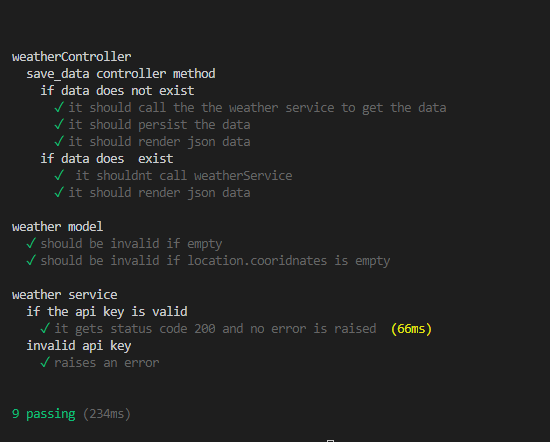
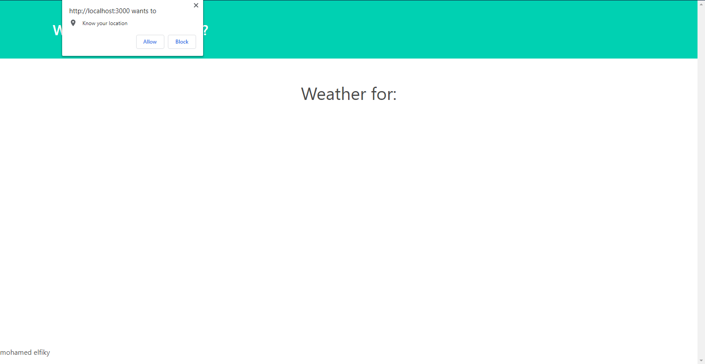

# Weather Porxy 

# Description
The app is just a proxy to call the OpenWeatherMap API .
It uses MongoDB to "Cache" the API responses and render them to the user if it was avilable .
By caching the responses we reduce the load on the external API .

# Main Page

# Why MongoDB
At first i wanted to user Redis, but Mongo has a great support for geolocation data .  
It allows storing the geolocation (GeoJson) and set expiry time for the API response per that geolocaion (and surrounding area - 10000 meter),   
thus kepping the accuracy of the weather results and reducing the api calls .    

# Why use GeoJson
I could have used an external API to get the city from the cooridnates but i wanted to reduce
the depedecny on external APIs .      
With GeoJson i have achieved a similar goal .  

# Runnig the tests:  
 npm run tests

# Running the server:
 npm run start

# Test Results

# Welcom Page

